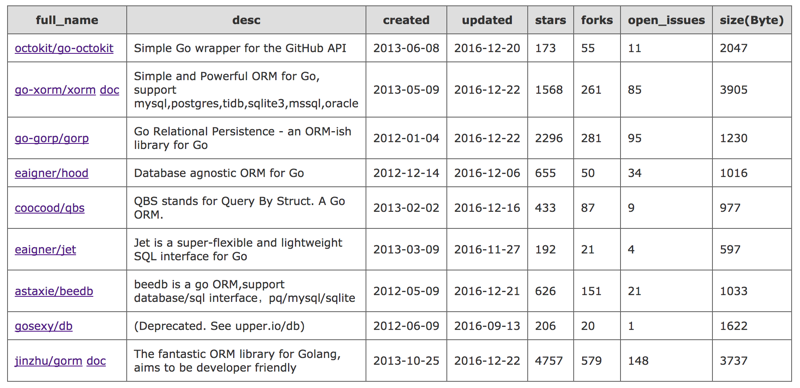
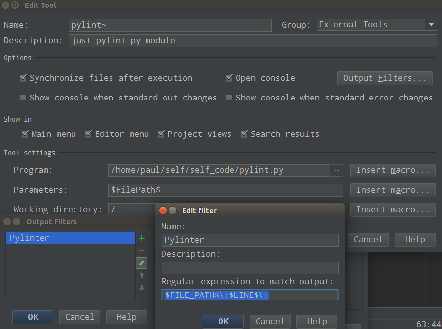

# repos_info

该程序用于对多个github上的项目进行摘要信息收集，显示信息包括点赞数、Fork数目、repos size等各种信息显示，生成的表格可以按照升降序进行排列，该程序为python程序，需要安装tornado， `pip install tornado`，程序默认启动端口为8888，然后可以使用get方式进行访问。

参考:
 
1. [Github API v3](https://developer.github.com/v3/)
2. [sortable](http://www.kryogenix.org/code/browser/sorttable/)

## 1. 运行程序

 	$ yum install python-pip
 	$ sudo pip install requests
	$ sudo pip install tornado
	$ python github_repo_info.py
	

## 2. 使用
通过浏览器地址访问，例如需要对于go orm多个项目进行比较，则输入：（多个repo使用“,”分割）

	   http://127.0.0.1:8888/?repos=octokit/go-octokit,go-xorm/xorm,go-gorp/gorp,eaigner/hood,coocood/qbs,eaigner/jet,astaxie/beedb,gosexy/db,jinzhu/gorm
	   
	   
根据网络情况可能会等待几秒：可以点击表头进行相关排序。

在线测试：[www.do1618.com](http://www.do1618.com:8888/?repos=octokit/go-octokit,go-xorm/xorm,go-gorp/gorp,eaigner/hood,coocood/qbs,eaigner/jet,astaxie/beedb,gosexy/db,jinzhu/gorm)

### 3. pylint 检查集成

参考：[Pycharm 集成Pylint](https://my.oschina.net/niuqingshan/blog/637893)

##### 3.1 pylint与PyCharm集成

首先编写一个pylint.py

	#! /usr/bin/python
	# encoding:utf8

	import sys
	import subprocess

	PYLINT = 'pylint'
	FILE_PATH = sys.argv[1]

	def run_pylint():
    	if FILE_PATH == "":
        	return "Please input filename"

    	command = [PYLINT, FILE_PATH, "-f", "parseable"]  # 指定输出格式]
    	try:
        	output = subprocess.check_output(command, stderr=subprocess.STDOUT)
    	except subprocess.CalledProcessError as err:
        	output = err.output
    	return output

	def main():
    	if not FILE_PATH.endswith(".py"):
        	print "pylint not support file type"
        	return
        	
    	output = run_pylint()
    	print output

	if __name__ == '__main__':
    	main()

[pylint.py](pylint.py)

#### Pycharm添加扩展工具

PyCharm -> Pereferences -> Tools ->  External Tools: 

### 4. TODO
根据stars进行图片显示。
	   
	   
	   
	   
